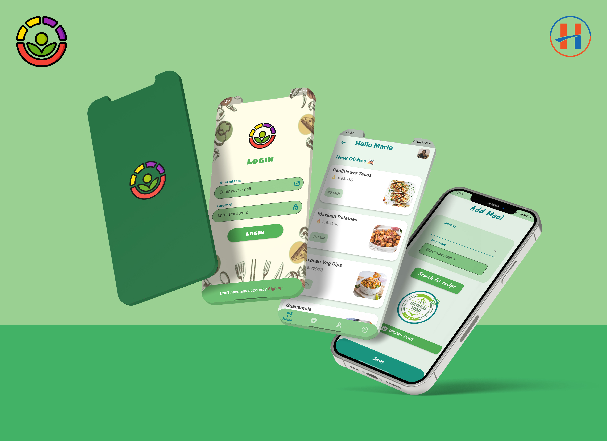

# Meal Tracker App

Meal Tracker application is build in flutter for android and iOS devices.In this project we used firebase database  for email authentication and to store - retrieve meal data. User can edit and delete meals also. For email and password user can also edit their email and password using firebase authentication. User can change theme mode according to their preference. This meal planner app have beautiful and smooth user friendly UI design.

**Features**:

- Improved mobile UI/UX.

- Fully responsive UI.

- On-boarding screen with animation.

- Sign-up and sign in screen.

- Firebase email and password authentication.

- Light, Dark and system default theme mode.

- Used table calender for cleanly track weekly and monthly meals.

- Add, update and delete meals.

- Update email and password using firebase authentication.

